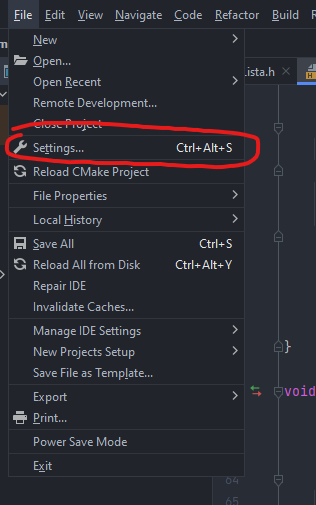
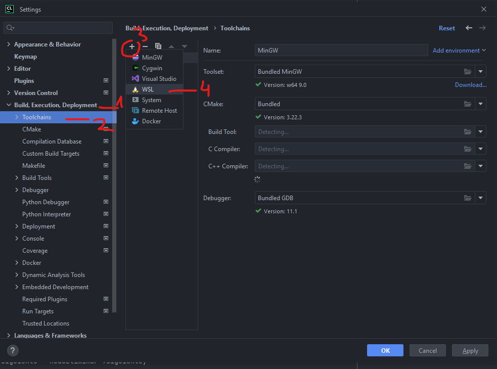
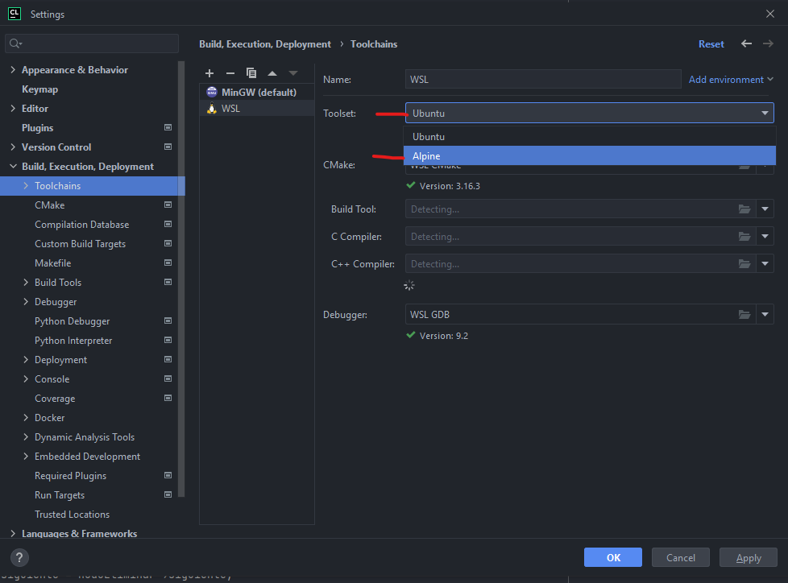
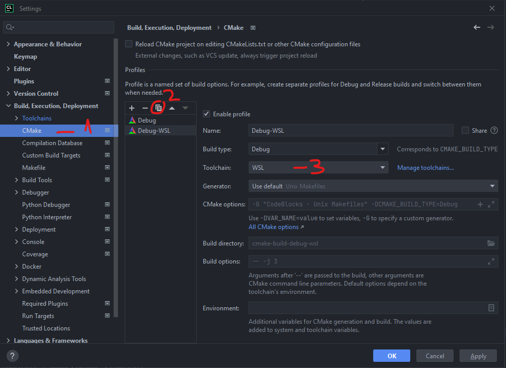
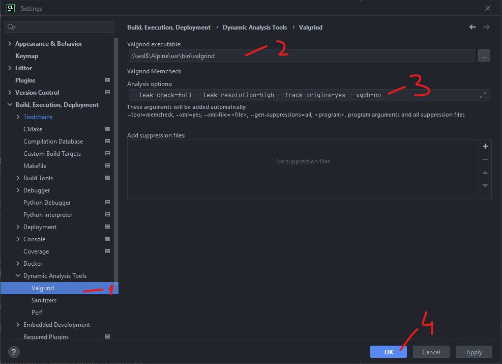
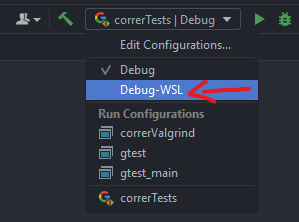

## Habilitar WSL

- Abrir PowerShell como Admin 
- `Enable-WindowsOptionalFeature -Online -FeatureName Microsoft-Windows-Subsystem-Linux`
- reiniciar windows

## Instalar Alpine Linux

- Abrir microsoft store 
- buscar Alpine WSL
- click Obtener
- click Abrir
- en la consola Alpine que se abre:
    - esperar que instale
    - ingresar usuario de linux
    - ingresar y repetir contraseña linux

## Instalar c++, cmake, valgrind, etc en Alpine

- En la misma consola alpine(*al final si se te cerro):
    - `su`
    - ingresar contraseña linux
    - `apk add --update gcc g++ gdb clang make ninja cmake autoconf automake dos2unix rsync tar valgrind python3`
- cerrar ventana
- reiniciar windows

## Configurar CLion

- File -> Settings

- Build, Execution, Deployment -> Toolchains
    - \+ -> WSL
    - Toolset: Alpine

- Build, Execution, Deployment -> CMake
    - Seleccionar Debug y copiar
    - Toolchain: WSL

- Build, Execution, Deployment -> Dynamic Analisys Tools -> Valgrind
    - Valgrind executable: `\\wsl$\Alpine\usr\bin\valgrind`
    - Analysis options: `--leak-check=full --leak-resolution=high --track-origins=yes --vgdb=no`
- OK

- En el desplegable de configuraciones ahora aparece Debug-WSL (si no aparece, esperar o reiniciar CLion). Seleccionar Debug-WSL y ya se puede correr con Valgrind.

### (*) si cerraste la consola alpine.
- abrir powershell
- `wsl -d Alpine`

### Si usas git:

agregar a `.gitignore`:

`**/cmake-build-debug-wsl/`